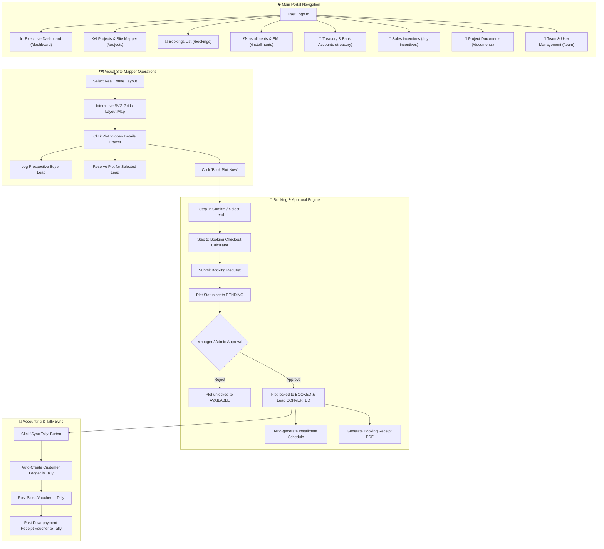
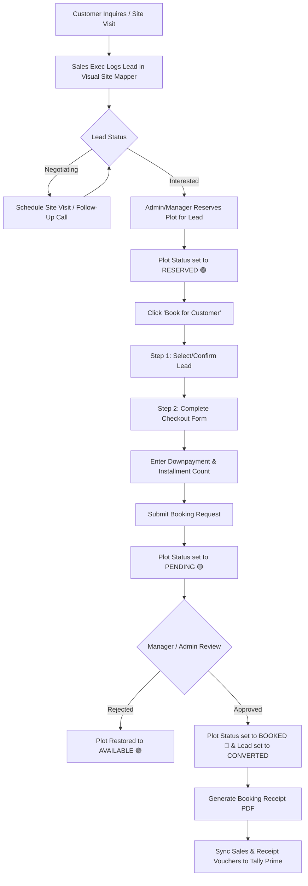
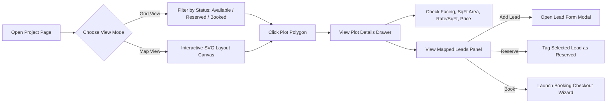
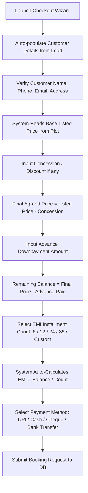
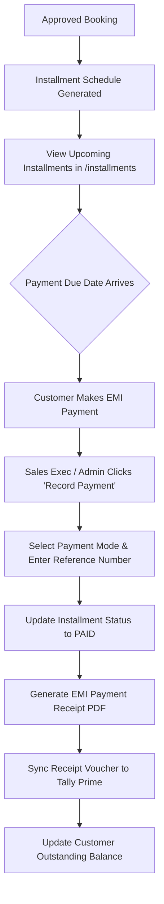
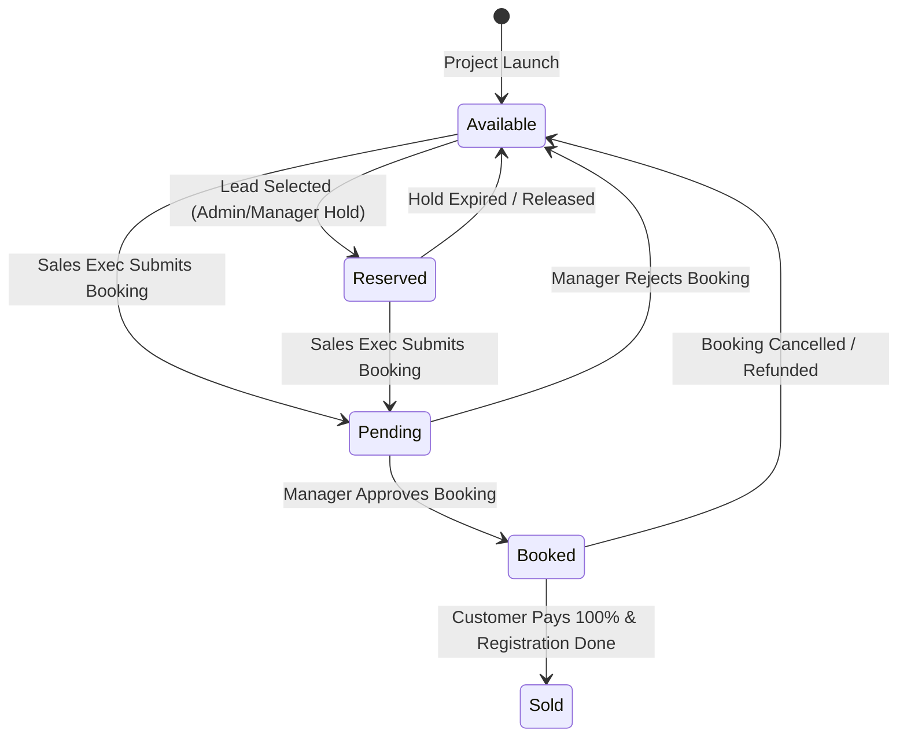
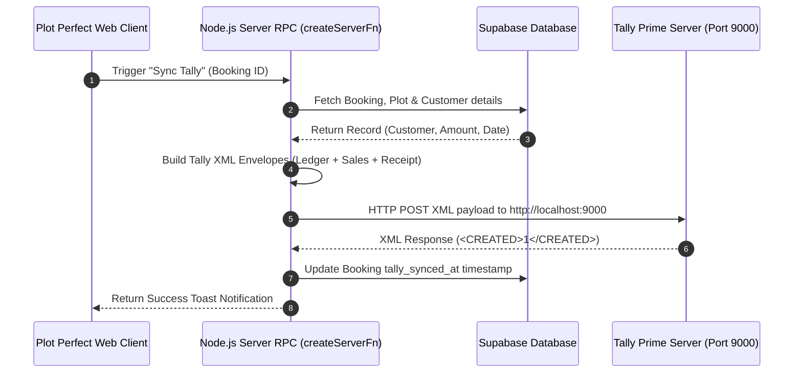

# 📘 Terra Site Manager (Plot Perfect) — Complete Instruction & System Manual

Welcome to the **Terra Site Manager (Plot Perfect)** official instruction manual. This guide provides an end-to-end overview of the system architecture, user roles, project management tools, lead pipelines, step-by-step plot booking workflows, financial treasury management, and real-time Tally Prime accounting synchronization.

---

## 📑 Table of Contents
1. [🌟 System Overview & Key Architecture](#-system-overview--key-architecture)
2. [👥 User Roles & Permission Matrix](#-user-roles--permission-matrix)
3. [🗺️ Core Modules & Feature Breakdown](#️-core-modules--feature-breakdown)
   - [1. Executive Dashboard](#1-executive-dashboard)
   - [2. Projects & Interactive Visual Site Mapper](#2-projects--interactive-visual-site-mapper)
   - [3. Plot Lead Management Pipeline](#3-plot-lead-management-pipeline)
   - [4. Plot Booking Engine & Checkout](#4-plot-booking-engine--checkout)
   - [5. Bookings & Manager Approval Workflow](#5-bookings--manager-approval-workflow)
   - [6. Installment Payment Schedule & Receipts](#6-installment-payment-schedule--receipts)
   - [7. Treasury & Project Bank Accounts](#7-treasury--project-bank-accounts)
   - [8. Real-Time Tally Prime Sync Engine](#8-real-time-tally-prime-sync-engine)
   - [9. Sales Executive Incentives & Commission Tracking](#9-sales-executive-incentives--commission-tracking)
   - [10. Project Documents Repository](#10-project-documents-repository)
4. [🔄 System Flowcharts & Mermaid Diagrams](#-system-flowcharts--mermaid-diagrams)
   - [A. Master System Navigation & Operations Flowchart](#a-master-system-navigation--operations-flowchart)
   - [B. End-to-End Lead-to-Booking Lifecycle Flowchart](#b-end-to-end-lead-to-booking-lifecycle-flowchart)
   - [C. Interactive Visual Site Mapper User Flowchart](#c-interactive-visual-site-mapper-user-flowchart)
   - [D. Plot Booking Checkout & Calculator Flowchart](#d-plot-booking-checkout--calculator-flowchart)
   - [E. Installment Payment Collection & EMI Flowchart](#e-installment-payment-collection--emi-flowchart)
   - [F. Plot Status State Diagram](#f-plot-status-state-diagram)
   - [G. Real-Time Tally Prime Sync Engine Sequence Diagram](#g-real-time-tally-prime-sync-engine-sequence-diagram)
   - [H. Treasury & Capital Transfer Flowchart](#h-treasury--capital-transfer-flowchart)
5. [📖 Step-by-Step Guide: How to Add & Process a Plot Booking](#-step-by-step-guide-how-to-add--process-a-plot-booking)
   - [Method A: Booking via the Visual Site Mapper](#method-a-booking-via-the-visual-site-mapper)
   - [Method B: Booking directly from a Prospect Lead](#method-b-booking-directly-from-a-prospect-lead)
   - [Completing the Booking Checkout Form](#completing-the-booking-checkout-form)
   - [Manager/Admin Review & Approval](#manageradmin-review--approval)
   - [Syncing the Voucher to Tally Prime](#syncing-the-voucher-to-tally-prime)
6. [🗄️ Database Tables & Data Model Reference](#️-database-tables--data-model-reference)
7. [❓ Troubleshooting & Frequently Asked Questions](#-troubleshooting--frequently-asked-questions)

---

## 🌟 System Overview & Key Architecture

**Terra Site Manager** (internally code-named **Plot Perfect**) is an enterprise real-estate site mapping, lead tracking, plot inventory, and sales management portal. Built with **React**, **TanStack Router**, **TanStack Query**, **Tailwind CSS / Lucide React**, **Supabase**, and **Tally Prime HTTP XML API**, it bridges field sales, management approvals, and corporate accounting.

```
┌─────────────────────────────────────────────────────────────────────────────┐
│                          TERRA SITE MANAGER FRONTEND                        │
│             (TanStack Router + React + Tailwind CSS + Lucide)               │
└───────────────────────┬─────────────────────────────┬───────────────────────┘
                        │                             │
                        ▼                             ▼
┌──────────────────────────────────────┐    ┌─────────────────────────────────┐
│          SUPABASE BACKEND            │    │     NODE.JS TALLY SYNC ENGINE   │
│ (PostgreSQL, Auth RLS, Edge Handlers)│    │ (postToTallyServerFn / Script)  │
└──────────────────────────────────────┘    └────────────────┬────────────────┘
                                                             │ HTTP XML (Port 9000)
                                                             ▼
                                            ┌─────────────────────────────────┐
                                            │     TALLY PRIME ACCOUNTING      │
                                            │      (Company: HAEGL Tech)      │
                                            └─────────────────────────────────┘
```

---

## 👥 User Roles & Permission Matrix

Terra Site Manager enforces Role-Based Access Control (RBAC) defined via the `app_role` enum in Supabase.

### Available User Roles
1. 🛡️ **Super Admin (`super_admin`)**
   - Full control over system configuration, database tables, user role assignments, project creation/deletion, financial overrides, and bulk Tally sync.
2. 🔑 **Admin (`admin`)**
   - Manages projects, plot pricing/dimensions, lead reservations, booking approvals/rejections, team member onboarding, and treasury transfers.
3. 👔 **Manager (`manager`)**
   - Oversees team sales performance, reviews pending booking submissions, approves/rejects sales requests, reserves plots for high-value clients, and views executive incentives.
4. 💼 **Sales Executive / Employee (`employee`)**
   - Logs prospective plot leads, schedules site visits, reserves plots (with admin approval), initiates customer plot bookings, prints payment receipts, and tracks earned incentives.
5. 📊 **Management / Executives (`management`)**
   - Strategic overview access: view-only dashboards, high-level financial reporting, plot availability heatmaps, treasury tally balances, and project analytics.

---

### 📋 Feature Permission Matrix

| Feature Module | Super Admin | Admin | Manager | Sales Executive | Management |
| :--- | :---: | :---: | :---: | :---: | :---: |
| **View Dashboard & Visual Site Map** | ✅ | ✅ | ✅ | ✅ | ✅ |
| **Create / Edit Projects** | ✅ | ✅ | ❌ | ❌ | ❌ |
| **Add & Log Plot Leads** | ✅ | ✅ | ✅ | ✅ | ❌ |
| **Reserve Plot for a Lead** | ✅ | ✅ | ✅ | ❌ | ❌ |
| **Initiate Plot Booking** | ✅ | ✅ | ✅ | ✅ | ❌ |
| **Approve / Reject Bookings** | ✅ | ✅ | ✅ | ❌ | ❌ |
| **Record Installment Payments** | ✅ | ✅ | ✅ | ✅ | ❌ |
| **Execute Treasury Transfers** | ✅ | ✅ | ❌ | ❌ | ❌ |
| **Sync Vouchers to Tally Prime** | ✅ | ✅ | ✅ | ❌ | ❌ |
| **View System Team Directory** | ✅ | ✅ | ✅ | ✅ | ✅ |
| **View Personal Incentives** | ✅ | ✅ | ✅ | ✅ | ❌ |
| **View Full Incentive Analytics** | ✅ | ✅ | ✅ | ❌ | ✅ |

---

## 🗺️ Core Modules & Feature Breakdown

### 1. Executive Dashboard
- **Location**: `/dashboard`
- **Key Features**:
  - Top KPI Cards: Total Projects, Total Plots, Booked Plots, Revenue Collected, Pending Approval Count.
  - Interactive Project Selector & Revenue Breakdown Chart.
  - Recent Plot Booking Activity Stream.
  - Quick Action Buttons: *Add Project*, *Book Plot*, *Record Receipt*, *Sync Tally*.

### 2. Projects & Interactive Visual Site Mapper
- **Location**: `/projects` and `/projects/$id`
- **Key Features**:
  - **Grid & Map Layout Modes**: Toggle between visual grid view and interactive SVG/polygon site layout canvas.
  - **Color-Coded Plot Status**:
    - 🟢 **Available** (Ready for prospective leads or direct booking)
    - 🟡 **Pending** (Booking submitted, awaiting manager approval)
    - 🔴 **Booked / Sold** (Approved & locked)
    - 🟣 **Reserved** (On hold for a specific customer lead)
  - **Plot Details Drawer**: Displays plot dimensions (length × width), total area (sq. ft.), rate per sq. ft., facing direction (North, East, South, West, etc.), road width, corner plot tags, and calculated incentive percentage.
  - **Project Documents**: Direct access to uploaded layout blueprints, legal approvals, and title deeds.

### 3. Plot Lead Management Pipeline
- **Location**: Embedded inside `/projects/$id` (Leads Panel) & `/leads`
- **Key Features**:
  - Log multiple prospective buyers against a single plot before converting one to a booking.
  - Track lead source (Walk-in, Referral, Digital Ad, Phone Inquiry, Expo).
  - Status progression: `New` ➔ `Contacted` ➔ `Meeting Scheduled` ➔ `Negotiating` ➔ `Converted` ➔ `Dropped`.
  - Direct actions: Tap-to-call phone shortcut, WhatsApp message launcher, set site-visit reminders.
  - **Reserve Plot Action**: Admin/Manager can pin a lead, reserving the plot exclusively for them.

### 4. Plot Booking Engine & Checkout
- **Location**: `/plots/$plotId/book` & `/plots/$plotId/book/checkout`
- **Key Features**:
  - Two-step wizard for plot booking.
  - Auto-populates customer data from an existing Lead or allows quick new lead creation.
  - Dynamic pricing calculator: Price = Listed Price - Concession. Automatically calculates downpayment, remaining balance, installment frequency (e.g. 6, 12, 24, 36 months, or custom EMI), per-installment amount, and executive incentive.

### 5. Bookings & Manager Approval Workflow
- **Location**: `/bookings`
- **Key Features**:
  - Comprehensive table listing all customer bookings across all real estate projects.
  - Approval state machine: `Pending` ➔ `Approved` / `Rejected` / `On Hold` / `Cancelled`.
  - Manager approval modal: Approve booking with a single click, instantly locking the plot inventory as `Booked`.
  - PDF/Printable Booking Receipt generator.

### 6. Installment Payment Schedule & Receipts
- **Location**: `/installments`
- **Key Features**:
  - Automatic EMI installment breakdown per booking.
  - Track upcoming due dates, paid installments, overdues, and remaining customer balances.
  - Record installment collections via cash, UPI, cheque, or bank transfer.
  - Auto-generate printable payment receipt vouchers.

### 7. Treasury & Project Bank Accounts
- **Location**: `/treasury` & `/treasury/$transferId`
- **Key Features**:
  - Manage project bank collection accounts (e.g., HDFC Bank Collection A/c, ICICI Escrow A/c).
  - Inter-project fund reallocation transfers.
  - Treasury tally ledger modal for tracking balance movements across development phases.

### 8. Real-Time Tally Prime Sync Engine
- **Location**: Embedded across `/bookings`, `/installments`, `/treasury`, and `scripts/test-tally.js`
- **Key Features**:
  - Direct HTTP XML API connection with **Tally Prime** running on Port `9000`.
  - Automatic Customer Ledger Creation under `Sundry Debtors`.
  - Posts **Sales Vouchers** (for Plot Booking Revenue), **Receipt Vouchers** (for Downpayments & Installments), and **Journal Vouchers** (for Treasury Transfers).
  - Toast alerts confirming Tally Master creation (`<CREATED>1</CREATED>`).

### 9. Sales Executive Incentives & Commission Tracking
- **Location**: `/incentives` & `/my-incentives`
- **Key Features**:
  - Real-time commission dashboard for Sales Executives.
  - Tiered percentage calculations per plot sale.
  - Performance leaderboard and monthly incentive payout tracking.

### 10. Project Documents Repository
- **Location**: `/documents` & Project Detail Tabs
- **Key Features**:
  - Centralized cloud document manager.
  - Upload layout maps, RERA registration files, encumbrance certificates, and customer agreement drafts.
  - Embedded Document Viewer Modal supporting PDFs and images.

---

## 🔄 System Flowcharts & Mermaid Diagrams

### A. Master System Navigation & Operations Flowchart



---

### B. End-to-End Lead-to-Booking Lifecycle Flowchart



---

### C. Interactive Visual Site Mapper User Flowchart



---

### D. Plot Booking Checkout & Calculator Flowchart



---

### E. Installment Payment Collection & EMI Flowchart



---

### F. Plot Status State Diagram



---

### G. Real-Time Tally Prime Sync Engine Sequence Diagram



---

### H. Treasury & Capital Transfer Flowchart

```mermaid
flowchart LR
    A[Project A Bank Collection Account] -->|Click Transfer Funds| B[Treasury Modal]
    B -->|Select Destination Project & Enter Amount| C[Submit Transfer]
    C -->|Database Write| D[Create Treasury Transfer Entry]
    D -->|Tally Sync Engine| E[Build Journal Voucher XML]
    E -->|HTTP POST Port 9000| F[Tally Prime: Inter-Project Transfer Ledger]
    F --> G[Project B Development Fund Updated]
```



---

## 📖 Step-by-Step Guide: How to Add & Process a Plot Booking

Follow these exact steps to record a new plot booking in the system.

### Method A: Booking via the Visual Site Mapper

1. **Navigate to Projects**:
   - Click **Projects** on the main sidebar navigation menu (`/projects`).
   - Select the target real-estate project (e.g., *Grand Meadows Phase I*).
2. **Locate & Click the Target Plot**:
   - On the interactive plot grid or visual canvas layout map, locate the plot (e.g., `Plot #101`).
   - Click the plot card or polygon area to open the **Plot Details Drawer**.
3. **Initiate Booking**:
   - Verify the plot status is **Available** (Green) or **Reserved** (Purple).
   - Click the prominent terracotta **Book Plot Now** button.

---

### Method B: Booking directly from a Prospect Lead

1. **Open the Leads Panel**:
   - Open the target project page (`/projects/$id`).
   - In the right-hand panel, click the **Leads** tab.
2. **Select the Lead**:
   - Locate the prospective buyer card in the lead list.
   - Click the **Book for Them** / **Convert to Booking** button on the card.
3. **Automatic Pre-fill**:
   - The booking wizard will launch with the lead's name, phone number, email, and notes automatically pre-filled.

---

### Completing the Booking Checkout Form

Once inside the **Booking Checkout Wizard** (`/plots/$plotId/book/checkout`):

```
┌─────────────────────────────────────────────────────────────────────────────┐
│ 📝 STEP 1: CUSTOMER & SALES EXECUTIVE DETAILS                               │
│ - Customer Full Name *                                                       │
│ - Customer Phone Number *                                                   │
│ - Customer Email & Address                                                  │
│ - Assigned Sales Executive                                                  │
├─────────────────────────────────────────────────────────────────────────────┤
│ 💰 STEP 2: FINANCIAL CALCULATOR                                             │
│ - Listed Plot Price: ₹25,00,000 (Auto-calculated from rate/sqft)            │
│ - Concession / Discount: ₹0                                                 │
│ - Final Agreed Sale Price *: ₹25,00,000                                     │
│ - Advance Paid Today (Booking Amount) *: ₹5,00,000                          │
│ - Remaining Balance: ₹20,00,000                                             │
├─────────────────────────────────────────────────────────────────────────────┤
│ 📅 STEP 3: PAYMENT METHOD & INSTALLMENT PLAN                                 │
│ - Payment Mode: [ UPI / Cash / Cheque / Bank Transfer / Net Banking ]       │
│ - Installment Frequency: [ 6 Months / 12 Months / 24 Months / Custom ]      │
│ - Calculated Per Installment Amount: ₹1,66,667 / month                      │
│ - First Installment Due Date *: [ Select Calendar Date ]                   │
└─────────────────────────────────────────────────────────────────────────────┘
```

- Click **Confirm & Submit Booking Request**.
- The system immediately registers the booking with status `Pending` and updates the plot status to `Pending` (Yellow), preventing double-booking.

---

### Manager/Admin Review & Approval

1. Navigate to **Bookings** (`/bookings`).
2. Filter by status: **Pending Approval**.
3. Review customer details, agreement price, downpayment amount, and sales executive attribution.
4. Click **Approve Booking**:
   - The plot status transitions to **Booked** (Red).
   - The associated lead status is automatically marked as **Converted**.
   - An installment repayment schedule is automatically generated under **Installments**.

---

### Syncing the Voucher to Tally Prime

1. In the **Bookings** table (`/bookings`), locate the approved booking row.
2. Click the green **Sync Tally** database icon button.
3. The system executes the `postToTallyServerFn` RPC:
   - Creates the Customer Ledger (e.g. `Customer - Rajesh Kumar`) under `Sundry Debtors` in Tally.
   - Creates a **Sales Voucher** for the total plot booking amount (`₹25,00,000`).
   - Creates a **Receipt Voucher** for the advance paid today (`₹5,00,000`).
4. A green toast notification confirms: `Successfully synced to Tally Prime!`.

---

## 🗄️ Database Tables & Data Model Reference

The application uses Supabase PostgreSQL with the following core tables:

### Core Database Tables Schema

```
 ┌──────────────────────┐        ┌──────────────────────┐        ┌──────────────────────┐
 │       projects       │        │        plots         │        │      plot_leads      │
 ├──────────────────────┤        ├──────────────────────┤        ├──────────────────────┤
 │ id (PK, uuid)        │◄──────┐│ id (PK, uuid)        │◄──────┐│ id (PK, uuid)        │
 │ name (text)          │       ││ project_id (FK)      │       ││ plot_id (FK)         │
 │ code (text)          │       ││ plot_number (text)   │       ││ project_id (FK)      │
 │ location (text)      │       ││ area_sqft (numeric)  │       ││ name (text)          │
 │ status (enum)        │       ││ price (numeric)      │       ││ facing (enum)        ││ status (enum)        │
 └──────────────────────┘       ││ status (enum)        │       ││ created_by (FK)      │
                                └──────────┬────────────┘       ││ assigned_to (FK)     │
                                           │                    └──────────────────────┘
                                           │ ┌──────────────────────┐
                                           └─┤       bookings       │
                                             ├──────────────────────┤
                                             │ id (PK, uuid)        │
                                             │ plot_id (FK)         │
                                             │ customer_name (text) │
                                             │ booking_amount (num) │
                                             │ total_price (numeric)│
                                             │ status (enum)        │
                                             │ sales_executive_id   │
                                             │ approved_by (FK)     │
                                             └──────────────────────┘
```

---

## ❓ Troubleshooting & Frequently Asked Questions

### Q1: Why is Tally Prime showing a date error when syncing?
> **Answer**: Tally Educational Mode only accepts transactions dated on the **1st** of any month. The system includes an automatic formatter (`formatTallyDate`) that parses the transaction date into `YYYYMM01` format to ensure compliance during local demo testing.

### Q2: Who can edit plot prices and dimensions?
> **Answer**: Only users assigned the `super_admin` or `admin` role can edit plot dimensions, rate per sq. ft., or base prices in the Visual Site Mapper.

### Q3: What happens if a manager rejects a booking request?
> **Answer**: Upon rejection, the booking status turns `Rejected`, and the plot inventory status is automatically unlocked and returned to `Available` (Green) for other buyers.

### Q4: How are Sales Executive incentives calculated?
> **Answer**: Each plot record contains an `incentive_percentage` field. Upon booking approval, the executive receives `(final_price * incentive_percentage) / 100`, tracked automatically in the `/my-incentives` portal.

---

*Manual Document Version: 2.5 | System Build: Production Ready | Terra Site Manager / Plot Perfect*
